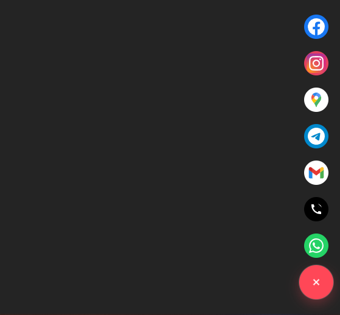

# React Floating Actions

A beautiful, customizable floating action button (FAB) component for React with support for multiple platforms (WhatsApp, Telegram, Gmail, Phone, and more) and smooth animations.

## Features

- **Customizable Theme** - Light and dark themes with color customization
- **Multiple Animations** - Pop, slide, stagger, radial, fade, and flip animations
- **Platform Support** - Built-in support for 17+ platforms including WhatsApp, Telegram, Gmail, Discord, and more
- **Positioned Anywhere** - Anchor the button to any corner of the screen
- **TypeScript Support** - Fully typed with TypeScript for better developer experience
- **Lightweight** - Minimal dependencies, tree-shakeable

## Installation

```bash
npm install react-floating-actions
# or
yarn add react-floating-actions
# or
pnpm add react-floating-actions
```

## Usage

### Basic Example

```tsx
import { FloatingActions } from 'react-floating-actions';

export function App() {
  return (
    <FloatingActions
      actions={[
        { type: 'whatsapp', value: '0501234567' },
        { type: 'gmail', value: 'support@example.com' },
        { type: 'telegram', value: 'username' },
      ]}
      options={{
        position: 'bottom-right',
        theme: 'light',
        animation: 'pop',
      }}
    />
  );
}
```

### Advanced Example

```tsx
import { FloatingActions } from 'react-floating-actions';
import type { Action, Options } from 'react-floating-actions';

export function App() {
  const actions: Action[] = [
    { type: 'whatsapp', value: '0501234567' },
    { type: 'phone', value: '+1234567890' },
    { type: 'gmail', value: 'contact@example.com' },
    { type: 'instagram', value: 'https://instagram.com/username' },
    { type: 'linkedin', value: 'https://linkedin.com/in/username' },
    { type: 'github', value: 'https://github.com/username' },
  ];

  const options: Options = {
    position: 'bottom-right',
    theme: 'dark',
    animation: 'radial',
    spacing: 75,
  };

  return <FloatingActions actions={actions} options={options} />;
}
```

## API Reference

### `<FloatingActions>`

The main component that renders the floating action button.

#### Props

- `actions` (required): Array of `Action` objects to display
- `options` (optional): Configuration object of type `Options`

### Types

#### `Action`

```typescript
interface Action {
  type: BuiltInActionType;
  value: string;
}
```

- `type`: Platform type (see below for supported types)
- `value`: Platform-specific value:
  - `whatsapp` / `phone`: Phone number (digits only, e.g., "0501234567")
  - `gmail`: Email address
  - `telegram`: Username (without @)
  - `googleMaps`: Location name or address
  - Other platforms: Full URL

#### `BuiltInActionType`

```typescript
type BuiltInActionType = 
  | 'whatsapp'
  | 'phone'
  | 'gmail'
  | 'googleMaps'
  | 'instagram'
  | 'facebook'
  | 'x'
  | 'linkedin'
  | 'github'
  | 'youtube'
  | 'discord'
  | 'google'
  | 'pinterest'
  | 'reddit'
  | 'snapchat'
  | 'telegram'
  | 'tiktok'
  | 'twitch'
```

#### `Options`

```typescript
interface Options {
  animation?: AnimationType;  // Default: 'pop'
  spacing?: number;          // Default: 60 (pixels)
  position?: Position;       // Default: 'bottom-right'
  theme?: Theme;             // Default: 'light'
}
```

#### `AnimationType`

```typescript
type AnimationType = 'pop' | 'slide' | 'stagger' | 'radial' | 'fade' | 'flip'
```

#### `Position`

```typescript
type Position = 'bottom-right' | 'bottom-left'
```

#### `Theme`

```typescript
type Theme = 'light' | 'dark'
```

### Examples

#### Radial View


#### Vertical View


## Browser Support

- Chrome/Edge: Latest 2 versions
- Firefox: Latest 2 versions
- Safari: Latest 2 versions

## License

MIT © 2026 react-floating-actions contributors

## Contributing

Contributions are welcome! Please feel free to submit a Pull Request.
